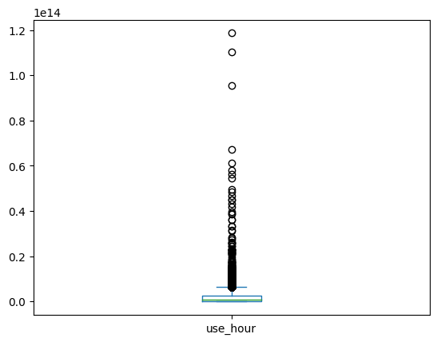
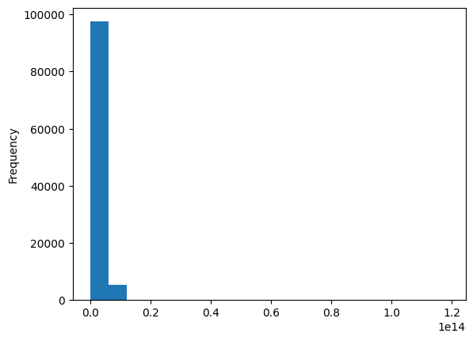

```python
import json
from tqdm import tqdm

import numpy as np
import pandas as pd

from sklearn.preprocessing import LabelEncoder, OneHotEncoder
```


```python
df = pd.read_csv('public_bicycle_2212.csv', encoding='cp949')
df = df.rename(columns={'대여 대여소번호': '대여대여소번호', '대여 대여소명': '대여대여소명'})
origin_df = df
df.head()
```


<div>
<style scoped>
    .dataframe tbody tr th:only-of-type {
        vertical-align: middle;
    }

    .dataframe tbody tr th {
        vertical-align: top;
    }

    .dataframe thead th {
        text-align: right;
    }
</style>
<table border="1" class="dataframe">
  <thead>
    <tr style="text-align: right;">
      <th></th>
      <th>자전거번호</th>
      <th>대여일시</th>
      <th>대여대여소번호</th>
      <th>대여대여소명</th>
      <th>대여거치대</th>
      <th>반납일시</th>
      <th>반납대여소번호</th>
      <th>반납대여소명</th>
      <th>반납거치대</th>
      <th>이용시간(분)</th>
      <th>이용거리(M)</th>
      <th>생년</th>
      <th>성별</th>
      <th>이용자종류</th>
      <th>대여대여소ID</th>
      <th>반납대여소ID</th>
    </tr>
  </thead>
  <tbody>
    <tr>
      <th>0</th>
      <td>SPB-44695</td>
      <td>2022-12-01 00:00:10</td>
      <td>1933</td>
      <td>개봉푸르지오아파트 상가</td>
      <td>0</td>
      <td>2022-12-01 00:00:20</td>
      <td>01933</td>
      <td>개봉푸르지오아파트 상가</td>
      <td>0</td>
      <td>0</td>
      <td>0.00</td>
      <td>\N</td>
      <td>M</td>
      <td>내국인</td>
      <td>ST-678</td>
      <td>ST-678</td>
    </tr>
    <tr>
      <th>1</th>
      <td>SPB-31562</td>
      <td>2022-12-01 00:00:04</td>
      <td>3007</td>
      <td>MBC 앞</td>
      <td>0</td>
      <td>2022-12-01 00:00:26</td>
      <td>03007</td>
      <td>MBC 앞</td>
      <td>0</td>
      <td>0</td>
      <td>111.20</td>
      <td>1995</td>
      <td>F</td>
      <td>내국인</td>
      <td>ST-2165</td>
      <td>ST-2165</td>
    </tr>
    <tr>
      <th>2</th>
      <td>SPB-56324</td>
      <td>2022-12-01 00:01:33</td>
      <td>4468</td>
      <td>가락1동주민센터</td>
      <td>0</td>
      <td>2022-12-01 00:01:58</td>
      <td>04468</td>
      <td>가락1동주민센터</td>
      <td>0</td>
      <td>0</td>
      <td>0.00</td>
      <td>1994</td>
      <td>M</td>
      <td>내국인</td>
      <td>ST-2583</td>
      <td>ST-2583</td>
    </tr>
    <tr>
      <th>3</th>
      <td>SPB-30175</td>
      <td>2022-12-01 00:03:02</td>
      <td>652</td>
      <td>답십리 래미안엘파인아파트 입구</td>
      <td>0</td>
      <td>2022-12-01 00:03:30</td>
      <td>00652</td>
      <td>답십리 래미안엘파인아파트 입구</td>
      <td>0</td>
      <td>0</td>
      <td>0.00</td>
      <td>1981</td>
      <td>M</td>
      <td>내국인</td>
      <td>ST-1447</td>
      <td>ST-1447</td>
    </tr>
    <tr>
      <th>4</th>
      <td>SPB-37639</td>
      <td>2022-12-01 00:00:18</td>
      <td>1047</td>
      <td>강동 한신휴플러스</td>
      <td>0</td>
      <td>2022-12-01 00:03:55</td>
      <td>01075</td>
      <td>천동초교 삼거리</td>
      <td>0</td>
      <td>3</td>
      <td>492.34</td>
      <td>1989</td>
      <td>M</td>
      <td>내국인</td>
      <td>ST-1369</td>
      <td>ST-1836</td>
    </tr>
  </tbody>
</table>
</div>


## Preprocessing


```python
def get_station_names(filename='station_names.json'):
    try:
        with open(filename) as f:
            station_names = json.load(f)
    except FileNotFoundError:
        station_names = dict()
        station_id_lt = pd.Series(np.concatenate([df['대여대여소ID'].unique(), df['반납대여소ID'].unique()], axis=0)).unique()
        for station_id in tqdm(station_id_lt):
            if station_id in df['대여대여소ID']:
                station_names[station_id] = df[df['대여대여소ID'] == station_id]['대여대여소명'].iloc[0]
            else:
                station_names[station_id] = df[df['반납대여소ID'] == station_id]['반납대여소명'].iloc[0]

        with open('station_names.json', 'w') as f:
            json.dump(station_names, f)
    
    return station_names

station_names = get_station_names()
```


```python
df.dtypes
```


    자전거번호       object
    대여일시        object
    대여대여소번호      int64
    대여대여소명      object
    대여거치대        int64
    반납일시        object
    반납대여소번호     object
    반납대여소명      object
    반납거치대       object
    이용시간(분)      int64
    이용거리(M)    float64
    생년          object
    성별          object
    이용자종류       object
    대여대여소ID     object
    반납대여소ID     object
    dtype: object


```python
df['대여일시'] = pd.to_datetime(df['대여일시'])
df['반납일시'] = pd.to_datetime(df['반납일시'])
df['이용시간(분)'] = pd.to_timedelta(df['이용시간(분)'], 'm')
df = df.drop(['대여대여소명', '반납대여소명', '대여대여소번호', '반납대여소번호'], axis=1)
df.head()
```


<div>
<style scoped>
    .dataframe tbody tr th:only-of-type {
        vertical-align: middle;
    }

    .dataframe tbody tr th {
        vertical-align: top;
    }

    .dataframe thead th {
        text-align: right;
    }
</style>
<table border="1" class="dataframe">
  <thead>
    <tr style="text-align: right;">
      <th></th>
      <th>자전거번호</th>
      <th>대여일시</th>
      <th>대여거치대</th>
      <th>반납일시</th>
      <th>반납거치대</th>
      <th>이용시간(분)</th>
      <th>이용거리(M)</th>
      <th>생년</th>
      <th>성별</th>
      <th>이용자종류</th>
      <th>대여대여소ID</th>
      <th>반납대여소ID</th>
    </tr>
  </thead>
  <tbody>
    <tr>
      <th>0</th>
      <td>SPB-44695</td>
      <td>2022-12-01 00:00:10</td>
      <td>0</td>
      <td>2022-12-01 00:00:20</td>
      <td>0</td>
      <td>0 days 00:00:00</td>
      <td>0.00</td>
      <td>\N</td>
      <td>M</td>
      <td>내국인</td>
      <td>ST-678</td>
      <td>ST-678</td>
    </tr>
    <tr>
      <th>1</th>
      <td>SPB-31562</td>
      <td>2022-12-01 00:00:04</td>
      <td>0</td>
      <td>2022-12-01 00:00:26</td>
      <td>0</td>
      <td>0 days 00:00:00</td>
      <td>111.20</td>
      <td>1995</td>
      <td>F</td>
      <td>내국인</td>
      <td>ST-2165</td>
      <td>ST-2165</td>
    </tr>
    <tr>
      <th>2</th>
      <td>SPB-56324</td>
      <td>2022-12-01 00:01:33</td>
      <td>0</td>
      <td>2022-12-01 00:01:58</td>
      <td>0</td>
      <td>0 days 00:00:00</td>
      <td>0.00</td>
      <td>1994</td>
      <td>M</td>
      <td>내국인</td>
      <td>ST-2583</td>
      <td>ST-2583</td>
    </tr>
    <tr>
      <th>3</th>
      <td>SPB-30175</td>
      <td>2022-12-01 00:03:02</td>
      <td>0</td>
      <td>2022-12-01 00:03:30</td>
      <td>0</td>
      <td>0 days 00:00:00</td>
      <td>0.00</td>
      <td>1981</td>
      <td>M</td>
      <td>내국인</td>
      <td>ST-1447</td>
      <td>ST-1447</td>
    </tr>
    <tr>
      <th>4</th>
      <td>SPB-37639</td>
      <td>2022-12-01 00:00:18</td>
      <td>0</td>
      <td>2022-12-01 00:03:55</td>
      <td>0</td>
      <td>0 days 00:03:00</td>
      <td>492.34</td>
      <td>1989</td>
      <td>M</td>
      <td>내국인</td>
      <td>ST-1369</td>
      <td>ST-1836</td>
    </tr>
  </tbody>
</table>
</div>


```python
df = df.replace({'\\N': np.nan})
```


```python
df['생년'] = df['생년'].astype('Int64')
#df['반납대여소번호'] = df['반납대여소번호'].astype('Int64')
df['반납거치대'] = df['반납거치대'].astype('Int64')
#df['대여대여소번호'] = df['반납대여소번호'].astype('Int64')
df['대여거치대'] = df['반납거치대'].astype('Int64')
```


```python
df.dtypes
```


    자전거번호               object
    대여일시        datetime64[ns]
    대여거치대                Int64
    반납일시        datetime64[ns]
    반납거치대                Int64
    이용시간(분)    timedelta64[ns]
    이용거리(M)            float64
    생년                   Int64
    성별                  object
    이용자종류               object
    대여대여소ID             object
    반납대여소ID             object
    dtype: object


```python
first_elements = []
for col in df.columns:
    first_elements.append(df[col].unique()[0])

first_elements
```


    ['SPB-44695',
     numpy.datetime64('2022-12-01T00:00:10.000000000'),
     0,
     numpy.datetime64('2022-12-01T00:00:20.000000000'),
     0,
     numpy.timedelta64(0,'ns'),
     0.0,
     <NA>,
     'M',
     '내국인',
     'ST-678',
     'ST-678']


```python
df['성별'] = df['성별'].replace({'m': 'M', 'f': 'F', '\\N': np.nan})
df['성별'].unique()
```


    array(['M', 'F', nan], dtype=object)


```python
df.isna().sum()
```


    자전거번호           0
    대여일시            0
    대여거치대        7008
    반납일시            0
    반납거치대        7008
    이용시간(분)         0
    이용거리(M)         0
    생년         135208
    성별         583430
    이용자종류           0
    대여대여소ID         0
    반납대여소ID      7008
    dtype: int64


```python
group = df.groupby('성별', dropna=False).describe().drop(
    [
        #'대여대여소번호', 
        '대여거치대', 
        '반납거치대', 
        #'반납대여소번호'
    ], 
    axis=1
)
group
```


<div>
<style scoped>
    .dataframe tbody tr th:only-of-type {
        vertical-align: middle;
    }

    .dataframe tbody tr th {
        vertical-align: top;
    }

    .dataframe thead tr th {
        text-align: left;
    }

    .dataframe thead tr:last-of-type th {
        text-align: right;
    }
</style>
<table border="1" class="dataframe">
  <thead>
    <tr>
      <th></th>
      <th colspan="8" halign="left">이용시간(분)</th>
      <th colspan="5" halign="left">이용거리(M)</th>
      <th colspan="8" halign="left">생년</th>
    </tr>
    <tr>
      <th></th>
      <th>count</th>
      <th>mean</th>
      <th>std</th>
      <th>min</th>
      <th>25%</th>
      <th>50%</th>
      <th>75%</th>
      <th>max</th>
      <th>count</th>
      <th>mean</th>
      <th>...</th>
      <th>75%</th>
      <th>max</th>
      <th>count</th>
      <th>mean</th>
      <th>std</th>
      <th>min</th>
      <th>25%</th>
      <th>50%</th>
      <th>75%</th>
      <th>max</th>
    </tr>
    <tr>
      <th>성별</th>
      <th></th>
      <th></th>
      <th></th>
      <th></th>
      <th></th>
      <th></th>
      <th></th>
      <th></th>
      <th></th>
      <th></th>
      <th></th>
      <th></th>
      <th></th>
      <th></th>
      <th></th>
      <th></th>
      <th></th>
      <th></th>
      <th></th>
      <th></th>
      <th></th>
    </tr>
  </thead>
  <tbody>
    <tr>
      <th>F</th>
      <td>425710</td>
      <td>0 days 00:17:42.210283996</td>
      <td>0 days 00:26:01.591568039</td>
      <td>0 days 00:00:00</td>
      <td>0 days 00:05:00</td>
      <td>0 days 00:10:00</td>
      <td>0 days 00:19:00</td>
      <td>1 days 21:30:00</td>
      <td>425710.0</td>
      <td>1737.865427</td>
      <td>...</td>
      <td>2050.0</td>
      <td>93230.98</td>
      <td>386638.0</td>
      <td>1988.057752</td>
      <td>15.506041</td>
      <td>0.0</td>
      <td>1980.0</td>
      <td>1991.0</td>
      <td>1997.0</td>
      <td>2099.0</td>
    </tr>
    <tr>
      <th>M</th>
      <td>806250</td>
      <td>0 days 00:16:55.807032558</td>
      <td>0 days 00:25:30.430437523</td>
      <td>0 days 00:00:00</td>
      <td>0 days 00:05:00</td>
      <td>0 days 00:09:00</td>
      <td>0 days 00:18:00</td>
      <td>1 days 16:42:00</td>
      <td>806250.0</td>
      <td>1852.663139</td>
      <td>...</td>
      <td>2140.0</td>
      <td>57590.00</td>
      <td>736805.0</td>
      <td>1986.314137</td>
      <td>21.988855</td>
      <td>0.0</td>
      <td>1977.0</td>
      <td>1989.0</td>
      <td>1996.0</td>
      <td>2099.0</td>
    </tr>
    <tr>
      <th>NaN</th>
      <td>583430</td>
      <td>0 days 00:17:11.365887938</td>
      <td>0 days 00:26:29.988526058</td>
      <td>0 days 00:00:00</td>
      <td>0 days 00:05:00</td>
      <td>0 days 00:09:00</td>
      <td>0 days 00:18:00</td>
      <td>1 days 14:33:00</td>
      <td>583430.0</td>
      <td>1806.386897</td>
      <td>...</td>
      <td>2090.0</td>
      <td>87742.16</td>
      <td>556739.0</td>
      <td>1987.045405</td>
      <td>15.204496</td>
      <td>1901.0</td>
      <td>1980.0</td>
      <td>1992.0</td>
      <td>1997.0</td>
      <td>2069.0</td>
    </tr>
  </tbody>
</table>
<p>3 rows × 24 columns</p>
</div>


```python
group['생년']
```


<div>
<style scoped>
    .dataframe tbody tr th:only-of-type {
        vertical-align: middle;
    }

    .dataframe tbody tr th {
        vertical-align: top;
    }

    .dataframe thead th {
        text-align: right;
    }
</style>
<table border="1" class="dataframe">
  <thead>
    <tr style="text-align: right;">
      <th></th>
      <th>count</th>
      <th>mean</th>
      <th>std</th>
      <th>min</th>
      <th>25%</th>
      <th>50%</th>
      <th>75%</th>
      <th>max</th>
    </tr>
    <tr>
      <th>성별</th>
      <th></th>
      <th></th>
      <th></th>
      <th></th>
      <th></th>
      <th></th>
      <th></th>
      <th></th>
    </tr>
  </thead>
  <tbody>
    <tr>
      <th>F</th>
      <td>386638.0</td>
      <td>1988.057752</td>
      <td>15.506041</td>
      <td>0.0</td>
      <td>1980.0</td>
      <td>1991.0</td>
      <td>1997.0</td>
      <td>2099.0</td>
    </tr>
    <tr>
      <th>M</th>
      <td>736805.0</td>
      <td>1986.314137</td>
      <td>21.988855</td>
      <td>0.0</td>
      <td>1977.0</td>
      <td>1989.0</td>
      <td>1996.0</td>
      <td>2099.0</td>
    </tr>
    <tr>
      <th>NaN</th>
      <td>556739.0</td>
      <td>1987.045405</td>
      <td>15.204496</td>
      <td>1901.0</td>
      <td>1980.0</td>
      <td>1992.0</td>
      <td>1997.0</td>
      <td>2069.0</td>
    </tr>
  </tbody>
</table>
</div>


```python
group['이용거리(M)']
```


<div>
<style scoped>
    .dataframe tbody tr th:only-of-type {
        vertical-align: middle;
    }

    .dataframe tbody tr th {
        vertical-align: top;
    }

    .dataframe thead th {
        text-align: right;
    }
</style>
<table border="1" class="dataframe">
  <thead>
    <tr style="text-align: right;">
      <th></th>
      <th>count</th>
      <th>mean</th>
      <th>std</th>
      <th>min</th>
      <th>25%</th>
      <th>50%</th>
      <th>75%</th>
      <th>max</th>
    </tr>
    <tr>
      <th>성별</th>
      <th></th>
      <th></th>
      <th></th>
      <th></th>
      <th></th>
      <th></th>
      <th></th>
      <th></th>
    </tr>
  </thead>
  <tbody>
    <tr>
      <th>F</th>
      <td>425710.0</td>
      <td>1737.865427</td>
      <td>2014.346012</td>
      <td>0.0</td>
      <td>714.58</td>
      <td>1190.000</td>
      <td>2050.0</td>
      <td>93230.98</td>
    </tr>
    <tr>
      <th>M</th>
      <td>806250.0</td>
      <td>1852.663139</td>
      <td>2213.190466</td>
      <td>0.0</td>
      <td>740.00</td>
      <td>1233.955</td>
      <td>2140.0</td>
      <td>57590.00</td>
    </tr>
    <tr>
      <th>NaN</th>
      <td>583430.0</td>
      <td>1806.386897</td>
      <td>2148.458372</td>
      <td>0.0</td>
      <td>730.00</td>
      <td>1220.000</td>
      <td>2090.0</td>
      <td>87742.16</td>
    </tr>
  </tbody>
</table>
</div>


```python
group['이용시간(분)']
```


<div>
<style scoped>
    .dataframe tbody tr th:only-of-type {
        vertical-align: middle;
    }

    .dataframe tbody tr th {
        vertical-align: top;
    }

    .dataframe thead th {
        text-align: right;
    }
</style>
<table border="1" class="dataframe">
  <thead>
    <tr style="text-align: right;">
      <th></th>
      <th>count</th>
      <th>mean</th>
      <th>std</th>
      <th>min</th>
      <th>25%</th>
      <th>50%</th>
      <th>75%</th>
      <th>max</th>
    </tr>
    <tr>
      <th>성별</th>
      <th></th>
      <th></th>
      <th></th>
      <th></th>
      <th></th>
      <th></th>
      <th></th>
      <th></th>
    </tr>
  </thead>
  <tbody>
    <tr>
      <th>F</th>
      <td>425710</td>
      <td>0 days 00:17:42.210283996</td>
      <td>0 days 00:26:01.591568039</td>
      <td>0 days 00:00:00</td>
      <td>0 days 00:05:00</td>
      <td>0 days 00:10:00</td>
      <td>0 days 00:19:00</td>
      <td>1 days 21:30:00</td>
    </tr>
    <tr>
      <th>M</th>
      <td>806250</td>
      <td>0 days 00:16:55.807032558</td>
      <td>0 days 00:25:30.430437523</td>
      <td>0 days 00:00:00</td>
      <td>0 days 00:05:00</td>
      <td>0 days 00:09:00</td>
      <td>0 days 00:18:00</td>
      <td>1 days 16:42:00</td>
    </tr>
    <tr>
      <th>NaN</th>
      <td>583430</td>
      <td>0 days 00:17:11.365887938</td>
      <td>0 days 00:26:29.988526058</td>
      <td>0 days 00:00:00</td>
      <td>0 days 00:05:00</td>
      <td>0 days 00:09:00</td>
      <td>0 days 00:18:00</td>
      <td>1 days 14:33:00</td>
    </tr>
  </tbody>
</table>
</div>


결측값이 어떤 카테고리와도 통계적 연관성이 존재하지 않음.

현재 목적은 모델 학습을 위한 데이터를 전처리하는 것이 아니라 통찰을 찾아내는 것이므로 `drop`함.


```python
df = df.dropna(axis=0)
len(origin_df), len(df), 1 - len(df) / len(origin_df)
```


    (1815390, 1119145, 0.38352365056544324)


대략 38% 데이터가 `drop`됨.


```python
df.head()
```


<div>
<style scoped>
    .dataframe tbody tr th:only-of-type {
        vertical-align: middle;
    }

    .dataframe tbody tr th {
        vertical-align: top;
    }

    .dataframe thead th {
        text-align: right;
    }
</style>
<table border="1" class="dataframe">
  <thead>
    <tr style="text-align: right;">
      <th></th>
      <th>자전거번호</th>
      <th>대여일시</th>
      <th>대여거치대</th>
      <th>반납일시</th>
      <th>반납거치대</th>
      <th>이용시간(분)</th>
      <th>이용거리(M)</th>
      <th>생년</th>
      <th>성별</th>
      <th>이용자종류</th>
      <th>대여대여소ID</th>
      <th>반납대여소ID</th>
    </tr>
  </thead>
  <tbody>
    <tr>
      <th>1</th>
      <td>SPB-31562</td>
      <td>2022-12-01 00:00:04</td>
      <td>0</td>
      <td>2022-12-01 00:00:26</td>
      <td>0</td>
      <td>0 days 00:00:00</td>
      <td>111.20</td>
      <td>1995</td>
      <td>F</td>
      <td>내국인</td>
      <td>ST-2165</td>
      <td>ST-2165</td>
    </tr>
    <tr>
      <th>2</th>
      <td>SPB-56324</td>
      <td>2022-12-01 00:01:33</td>
      <td>0</td>
      <td>2022-12-01 00:01:58</td>
      <td>0</td>
      <td>0 days 00:00:00</td>
      <td>0.00</td>
      <td>1994</td>
      <td>M</td>
      <td>내국인</td>
      <td>ST-2583</td>
      <td>ST-2583</td>
    </tr>
    <tr>
      <th>3</th>
      <td>SPB-30175</td>
      <td>2022-12-01 00:03:02</td>
      <td>0</td>
      <td>2022-12-01 00:03:30</td>
      <td>0</td>
      <td>0 days 00:00:00</td>
      <td>0.00</td>
      <td>1981</td>
      <td>M</td>
      <td>내국인</td>
      <td>ST-1447</td>
      <td>ST-1447</td>
    </tr>
    <tr>
      <th>4</th>
      <td>SPB-37639</td>
      <td>2022-12-01 00:00:18</td>
      <td>0</td>
      <td>2022-12-01 00:03:55</td>
      <td>0</td>
      <td>0 days 00:03:00</td>
      <td>492.34</td>
      <td>1989</td>
      <td>M</td>
      <td>내국인</td>
      <td>ST-1369</td>
      <td>ST-1836</td>
    </tr>
    <tr>
      <th>5</th>
      <td>SPB-39909</td>
      <td>2022-12-01 00:03:43</td>
      <td>0</td>
      <td>2022-12-01 00:03:56</td>
      <td>0</td>
      <td>0 days 00:00:00</td>
      <td>0.00</td>
      <td>1985</td>
      <td>M</td>
      <td>내국인</td>
      <td>ST-2760</td>
      <td>ST-2760</td>
    </tr>
  </tbody>
</table>
</div>


```python
# 폰트 문제로 영어로 Column 명을 바꿈
df = df.rename(
    columns={
        '자전거번호': 'bicycle_id',
        '대여일시': 'rent_time',
        '반납일시': 'return_time',
        '대여거치대': 'rent_dock',
        '반납거치대': 'return_dock',
        '이용시간(분)': 'use_hour',
        '이용거리(M)': 'move_dist',
        '생년': 'birth_year',
        '성별': 'gender',
        '이용자종류': 'user_type',
        '대여대여소ID': 'rent_station_id',
        '반납대여소ID': 'return_station_id'
    }
)

df['user_type'] = df['user_type'].replace({'내국인': 'local', '비회원': 'nonmember'})

df.head()
```


<div>
<style scoped>
    .dataframe tbody tr th:only-of-type {
        vertical-align: middle;
    }

    .dataframe tbody tr th {
        vertical-align: top;
    }

    .dataframe thead th {
        text-align: right;
    }
</style>
<table border="1" class="dataframe">
  <thead>
    <tr style="text-align: right;">
      <th></th>
      <th>bicycle_id</th>
      <th>rent_time</th>
      <th>rent_dock</th>
      <th>return_time</th>
      <th>return_dock</th>
      <th>use_hour</th>
      <th>move_dist</th>
      <th>birth_year</th>
      <th>gender</th>
      <th>user_type</th>
      <th>rent_station_id</th>
      <th>return_station_id</th>
    </tr>
  </thead>
  <tbody>
    <tr>
      <th>1</th>
      <td>SPB-31562</td>
      <td>2022-12-01 00:00:04</td>
      <td>0</td>
      <td>2022-12-01 00:00:26</td>
      <td>0</td>
      <td>0 days 00:00:00</td>
      <td>111.20</td>
      <td>1995</td>
      <td>F</td>
      <td>local</td>
      <td>ST-2165</td>
      <td>ST-2165</td>
    </tr>
    <tr>
      <th>2</th>
      <td>SPB-56324</td>
      <td>2022-12-01 00:01:33</td>
      <td>0</td>
      <td>2022-12-01 00:01:58</td>
      <td>0</td>
      <td>0 days 00:00:00</td>
      <td>0.00</td>
      <td>1994</td>
      <td>M</td>
      <td>local</td>
      <td>ST-2583</td>
      <td>ST-2583</td>
    </tr>
    <tr>
      <th>3</th>
      <td>SPB-30175</td>
      <td>2022-12-01 00:03:02</td>
      <td>0</td>
      <td>2022-12-01 00:03:30</td>
      <td>0</td>
      <td>0 days 00:00:00</td>
      <td>0.00</td>
      <td>1981</td>
      <td>M</td>
      <td>local</td>
      <td>ST-1447</td>
      <td>ST-1447</td>
    </tr>
    <tr>
      <th>4</th>
      <td>SPB-37639</td>
      <td>2022-12-01 00:00:18</td>
      <td>0</td>
      <td>2022-12-01 00:03:55</td>
      <td>0</td>
      <td>0 days 00:03:00</td>
      <td>492.34</td>
      <td>1989</td>
      <td>M</td>
      <td>local</td>
      <td>ST-1369</td>
      <td>ST-1836</td>
    </tr>
    <tr>
      <th>5</th>
      <td>SPB-39909</td>
      <td>2022-12-01 00:03:43</td>
      <td>0</td>
      <td>2022-12-01 00:03:56</td>
      <td>0</td>
      <td>0 days 00:00:00</td>
      <td>0.00</td>
      <td>1985</td>
      <td>M</td>
      <td>local</td>
      <td>ST-2760</td>
      <td>ST-2760</td>
    </tr>
  </tbody>
</table>
</div>


## EDA

### 잘못 빌린 자전거


```python
df[df['rent_station_id'] == df['return_station_id']]['use_hour'].astype(int).describe()
```


    count    1.029600e+05
    mean     1.628893e+12
    std      2.194852e+12
    min      0.000000e+00
    25%      0.000000e+00
    50%      9.000000e+11
    75%      2.580000e+12
    max      1.186800e+14
    Name: use_hour, dtype: float64


```python
df[df['rent_station_id'] == df['return_station_id']]['use_hour'].astype(int).plot.box()
```


    <AxesSubplot: >


    

    


```python
df[df['rent_station_id'] == df['return_station_id']]['use_hour'].astype(int).plot.hist(bins=20)
```


    <AxesSubplot: ylabel='Frequency'>


    

    


```python
miss_rent = (df['rent_station_id'] == df['return_station_id']) & (df['use_hour'].astype(int) < 0.2)
miss_rent.sum() * 100 / len(df)
```


    2.829660142340805


대략 2.8%의 사람들이 잘못 빌려감을 확인할 수 있음.


```python
def ranking(index, groupby, top=10):
    ranks = df[index].groupby(groupby, as_index=False).count()[[groupby, 'bicycle_id']].sort_values('bicycle_id', ascending=False).head(top)
    ranks = ranks.rename(columns={'bicycle_id': 'count'})
    ranks = ranks.set_index(groupby)
    
    return ranks

def station_ranking(index, groupby, top=10):
    ranks = ranking(index, groupby, top)
    ranks['station_name'] = ranks[groupby].replace(station_names)
    ranks = ranks[['station_name', 'count']]

    return ranks
```


```python
station_ranking(miss_rent, 'rent_station_id')
```


<div>
<style scoped>
    .dataframe tbody tr th:only-of-type {
        vertical-align: middle;
    }

    .dataframe tbody tr th {
        vertical-align: top;
    }

    .dataframe thead th {
        text-align: right;
    }
</style>
<table border="1" class="dataframe">
  <thead>
    <tr style="text-align: right;">
      <th></th>
      <th>station_name</th>
      <th>count</th>
    </tr>
    <tr>
      <th>rent_station_id</th>
      <th></th>
      <th></th>
    </tr>
  </thead>
  <tbody>
    <tr>
      <th>ST-2031</th>
      <td>마곡나루역 2번 출구</td>
      <td>121</td>
    </tr>
    <tr>
      <th>ST-1718</th>
      <td>마곡나루역 5번출구 뒤편</td>
      <td>117</td>
    </tr>
    <tr>
      <th>ST-2045</th>
      <td>마곡나루역 3번 출구</td>
      <td>94</td>
    </tr>
    <tr>
      <th>ST-668</th>
      <td>구로디지털단지역 앞</td>
      <td>84</td>
    </tr>
    <tr>
      <th>ST-1065</th>
      <td>발산역 1번, 9번 인근 대여소</td>
      <td>84</td>
    </tr>
    <tr>
      <th>ST-702</th>
      <td>봉림교 교통섬</td>
      <td>83</td>
    </tr>
    <tr>
      <th>ST-1731</th>
      <td>오목교역 3번출구</td>
      <td>79</td>
    </tr>
    <tr>
      <th>ST-413</th>
      <td>영등포구청역 1번출구</td>
      <td>77</td>
    </tr>
    <tr>
      <th>ST-891</th>
      <td>롯데월드타워(잠실역2번출구 쪽)</td>
      <td>73</td>
    </tr>
    <tr>
      <th>ST-2011</th>
      <td>양천구청, 보건소 사잇길</td>
      <td>70</td>
    </tr>
  </tbody>
</table>
</div>


마곡나루역에 상당한 문제가 있음을 확인할 수 있음.

추가로, [마곡나루역의 지도](https://map.naver.com/v5/search/%EB%A7%88%EA%B3%A1%EB%82%98%EB%A3%A8%EC%97%AD?c=16.85,0,0,0,dh)에서 확인해보니 짧은 거리를 이동하는 경우, 역 인근 이동이 많을 수 있음을 확인함.

### 남자, 여자가 가장 많이 빌리는 지역


```python
df.head()
```


<div>
<style scoped>
    .dataframe tbody tr th:only-of-type {
        vertical-align: middle;
    }

    .dataframe tbody tr th {
        vertical-align: top;
    }

    .dataframe thead th {
        text-align: right;
    }
</style>
<table border="1" class="dataframe">
  <thead>
    <tr style="text-align: right;">
      <th></th>
      <th>bicycle_id</th>
      <th>rent_time</th>
      <th>rent_dock</th>
      <th>return_time</th>
      <th>return_dock</th>
      <th>use_hour</th>
      <th>move_dist</th>
      <th>birth_year</th>
      <th>gender</th>
      <th>user_type</th>
      <th>rent_station_id</th>
      <th>return_station_id</th>
    </tr>
  </thead>
  <tbody>
    <tr>
      <th>1</th>
      <td>SPB-31562</td>
      <td>2022-12-01 00:00:04</td>
      <td>0</td>
      <td>2022-12-01 00:00:26</td>
      <td>0</td>
      <td>0 days 00:00:00</td>
      <td>111.20</td>
      <td>1995</td>
      <td>F</td>
      <td>local</td>
      <td>ST-2165</td>
      <td>ST-2165</td>
    </tr>
    <tr>
      <th>2</th>
      <td>SPB-56324</td>
      <td>2022-12-01 00:01:33</td>
      <td>0</td>
      <td>2022-12-01 00:01:58</td>
      <td>0</td>
      <td>0 days 00:00:00</td>
      <td>0.00</td>
      <td>1994</td>
      <td>M</td>
      <td>local</td>
      <td>ST-2583</td>
      <td>ST-2583</td>
    </tr>
    <tr>
      <th>3</th>
      <td>SPB-30175</td>
      <td>2022-12-01 00:03:02</td>
      <td>0</td>
      <td>2022-12-01 00:03:30</td>
      <td>0</td>
      <td>0 days 00:00:00</td>
      <td>0.00</td>
      <td>1981</td>
      <td>M</td>
      <td>local</td>
      <td>ST-1447</td>
      <td>ST-1447</td>
    </tr>
    <tr>
      <th>4</th>
      <td>SPB-37639</td>
      <td>2022-12-01 00:00:18</td>
      <td>0</td>
      <td>2022-12-01 00:03:55</td>
      <td>0</td>
      <td>0 days 00:03:00</td>
      <td>492.34</td>
      <td>1989</td>
      <td>M</td>
      <td>local</td>
      <td>ST-1369</td>
      <td>ST-1836</td>
    </tr>
    <tr>
      <th>5</th>
      <td>SPB-39909</td>
      <td>2022-12-01 00:03:43</td>
      <td>0</td>
      <td>2022-12-01 00:03:56</td>
      <td>0</td>
      <td>0 days 00:00:00</td>
      <td>0.00</td>
      <td>1985</td>
      <td>M</td>
      <td>local</td>
      <td>ST-2760</td>
      <td>ST-2760</td>
    </tr>
  </tbody>
</table>
</div>


```python
station_ranking(df['gender'] == 'M', 'rent_station_id')
```


<div>
<style scoped>
    .dataframe tbody tr th:only-of-type {
        vertical-align: middle;
    }

    .dataframe tbody tr th {
        vertical-align: top;
    }

    .dataframe thead th {
        text-align: right;
    }
</style>
<table border="1" class="dataframe">
  <thead>
    <tr style="text-align: right;">
      <th></th>
      <th>station_name</th>
      <th>count</th>
    </tr>
    <tr>
      <th>rent_station_id</th>
      <th></th>
      <th></th>
    </tr>
  </thead>
  <tbody>
    <tr>
      <th>ST-2031</th>
      <td>마곡나루역 2번 출구</td>
      <td>3078</td>
    </tr>
    <tr>
      <th>ST-1718</th>
      <td>마곡나루역 5번출구 뒤편</td>
      <td>2771</td>
    </tr>
    <tr>
      <th>ST-2045</th>
      <td>마곡나루역 3번 출구</td>
      <td>2164</td>
    </tr>
    <tr>
      <th>ST-668</th>
      <td>구로디지털단지역 앞</td>
      <td>1837</td>
    </tr>
    <tr>
      <th>ST-1065</th>
      <td>발산역 1번, 9번 인근 대여소</td>
      <td>1812</td>
    </tr>
    <tr>
      <th>ST-891</th>
      <td>롯데월드타워(잠실역2번출구 쪽)</td>
      <td>1803</td>
    </tr>
    <tr>
      <th>ST-702</th>
      <td>봉림교 교통섬</td>
      <td>1712</td>
    </tr>
    <tr>
      <th>ST-1546</th>
      <td>신대방역 2번 출구</td>
      <td>1625</td>
    </tr>
    <tr>
      <th>ST-413</th>
      <td>영등포구청역 1번출구</td>
      <td>1596</td>
    </tr>
    <tr>
      <th>ST-295</th>
      <td>당산역 10번출구 앞</td>
      <td>1498</td>
    </tr>
  </tbody>
</table>
</div>


```python
station_ranking(df['gender'] == 'M', 'return_station_id')
```


<div>
<style scoped>
    .dataframe tbody tr th:only-of-type {
        vertical-align: middle;
    }

    .dataframe tbody tr th {
        vertical-align: top;
    }

    .dataframe thead th {
        text-align: right;
    }
</style>
<table border="1" class="dataframe">
  <thead>
    <tr style="text-align: right;">
      <th></th>
      <th>station_name</th>
      <th>count</th>
    </tr>
    <tr>
      <th>return_station_id</th>
      <th></th>
      <th></th>
    </tr>
  </thead>
  <tbody>
    <tr>
      <th>ST-2031</th>
      <td>마곡나루역 2번 출구</td>
      <td>3109</td>
    </tr>
    <tr>
      <th>ST-1718</th>
      <td>마곡나루역 5번출구 뒤편</td>
      <td>2736</td>
    </tr>
    <tr>
      <th>ST-2045</th>
      <td>마곡나루역 3번 출구</td>
      <td>2182</td>
    </tr>
    <tr>
      <th>ST-1065</th>
      <td>발산역 1번, 9번 인근 대여소</td>
      <td>1843</td>
    </tr>
    <tr>
      <th>ST-668</th>
      <td>구로디지털단지역 앞</td>
      <td>1712</td>
    </tr>
    <tr>
      <th>ST-702</th>
      <td>봉림교 교통섬</td>
      <td>1708</td>
    </tr>
    <tr>
      <th>ST-413</th>
      <td>영등포구청역 1번출구</td>
      <td>1701</td>
    </tr>
    <tr>
      <th>ST-891</th>
      <td>롯데월드타워(잠실역2번출구 쪽)</td>
      <td>1663</td>
    </tr>
    <tr>
      <th>ST-18</th>
      <td>홍대입구역 2번출구 앞</td>
      <td>1618</td>
    </tr>
    <tr>
      <th>ST-1546</th>
      <td>신대방역 2번 출구</td>
      <td>1590</td>
    </tr>
  </tbody>
</table>
</div>


```python
station_ranking(df['gender'] == 'F', 'rent_station_id')
```


<div>
<style scoped>
    .dataframe tbody tr th:only-of-type {
        vertical-align: middle;
    }

    .dataframe tbody tr th {
        vertical-align: top;
    }

    .dataframe thead th {
        text-align: right;
    }
</style>
<table border="1" class="dataframe">
  <thead>
    <tr style="text-align: right;">
      <th></th>
      <th>station_name</th>
      <th>count</th>
    </tr>
    <tr>
      <th>rent_station_id</th>
      <th></th>
      <th></th>
    </tr>
  </thead>
  <tbody>
    <tr>
      <th>ST-2031</th>
      <td>마곡나루역 2번 출구</td>
      <td>1980</td>
    </tr>
    <tr>
      <th>ST-1718</th>
      <td>마곡나루역 5번출구 뒤편</td>
      <td>1500</td>
    </tr>
    <tr>
      <th>ST-891</th>
      <td>롯데월드타워(잠실역2번출구 쪽)</td>
      <td>1250</td>
    </tr>
    <tr>
      <th>ST-1065</th>
      <td>발산역 1번, 9번 인근 대여소</td>
      <td>1187</td>
    </tr>
    <tr>
      <th>ST-413</th>
      <td>영등포구청역 1번출구</td>
      <td>1000</td>
    </tr>
    <tr>
      <th>ST-2045</th>
      <td>마곡나루역 3번 출구</td>
      <td>993</td>
    </tr>
    <tr>
      <th>ST-522</th>
      <td>발산역 6번 출구 뒤</td>
      <td>953</td>
    </tr>
    <tr>
      <th>ST-1064</th>
      <td>마곡역교차로</td>
      <td>928</td>
    </tr>
    <tr>
      <th>ST-1681</th>
      <td>송파구청</td>
      <td>928</td>
    </tr>
    <tr>
      <th>ST-2871</th>
      <td>마곡역 7번출구</td>
      <td>917</td>
    </tr>
  </tbody>
</table>
</div>


```python
station_ranking(df['gender'] == 'F', 'return_station_id')
```


<div>
<style scoped>
    .dataframe tbody tr th:only-of-type {
        vertical-align: middle;
    }

    .dataframe tbody tr th {
        vertical-align: top;
    }

    .dataframe thead th {
        text-align: right;
    }
</style>
<table border="1" class="dataframe">
  <thead>
    <tr style="text-align: right;">
      <th></th>
      <th>station_name</th>
      <th>count</th>
    </tr>
    <tr>
      <th>return_station_id</th>
      <th></th>
      <th></th>
    </tr>
  </thead>
  <tbody>
    <tr>
      <th>ST-2031</th>
      <td>마곡나루역 2번 출구</td>
      <td>1871</td>
    </tr>
    <tr>
      <th>ST-1718</th>
      <td>마곡나루역 5번출구 뒤편</td>
      <td>1334</td>
    </tr>
    <tr>
      <th>ST-891</th>
      <td>롯데월드타워(잠실역2번출구 쪽)</td>
      <td>1308</td>
    </tr>
    <tr>
      <th>ST-1065</th>
      <td>발산역 1번, 9번 인근 대여소</td>
      <td>1140</td>
    </tr>
    <tr>
      <th>ST-2045</th>
      <td>마곡나루역 3번 출구</td>
      <td>1084</td>
    </tr>
    <tr>
      <th>ST-1681</th>
      <td>송파구청</td>
      <td>974</td>
    </tr>
    <tr>
      <th>ST-522</th>
      <td>발산역 6번 출구 뒤</td>
      <td>959</td>
    </tr>
    <tr>
      <th>ST-413</th>
      <td>영등포구청역 1번출구</td>
      <td>941</td>
    </tr>
    <tr>
      <th>ST-99</th>
      <td>뚝섬유원지역 1번출구 앞</td>
      <td>927</td>
    </tr>
    <tr>
      <th>ST-18</th>
      <td>홍대입구역 2번출구 앞</td>
      <td>905</td>
    </tr>
  </tbody>
</table>
</div>


```python
df['move_path'] = df['rent_station_id'].str.cat(df['return_station_id'], sep='->')
```


```python
ranking(pd.Series([True for _ in range(len(df))], index=df.index), 'move_path')
```


<div>
<style scoped>
    .dataframe tbody tr th:only-of-type {
        vertical-align: middle;
    }

    .dataframe tbody tr th {
        vertical-align: top;
    }

    .dataframe thead th {
        text-align: right;
    }
</style>
<table border="1" class="dataframe">
  <thead>
    <tr style="text-align: right;">
      <th></th>
      <th>count</th>
    </tr>
    <tr>
      <th>move_path</th>
      <th></th>
    </tr>
  </thead>
  <tbody>
    <tr>
      <th>ST-2965-&gt;ST-2871</th>
      <td>471</td>
    </tr>
    <tr>
      <th>ST-2268-&gt;ST-1298</th>
      <td>438</td>
    </tr>
    <tr>
      <th>ST-2871-&gt;ST-2965</th>
      <td>395</td>
    </tr>
    <tr>
      <th>ST-446-&gt;ST-506</th>
      <td>388</td>
    </tr>
    <tr>
      <th>ST-506-&gt;ST-106</th>
      <td>385</td>
    </tr>
    <tr>
      <th>ST-1681-&gt;ST-891</th>
      <td>382</td>
    </tr>
    <tr>
      <th>ST-479-&gt;ST-2264</th>
      <td>367</td>
    </tr>
    <tr>
      <th>ST-891-&gt;ST-1681</th>
      <td>355</td>
    </tr>
    <tr>
      <th>ST-2107-&gt;ST-1137</th>
      <td>341</td>
    </tr>
    <tr>
      <th>ST-2264-&gt;ST-479</th>
      <td>341</td>
    </tr>
  </tbody>
</table>
</div>


